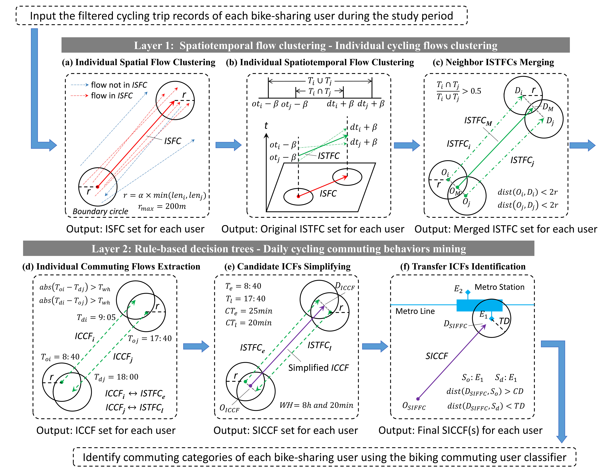
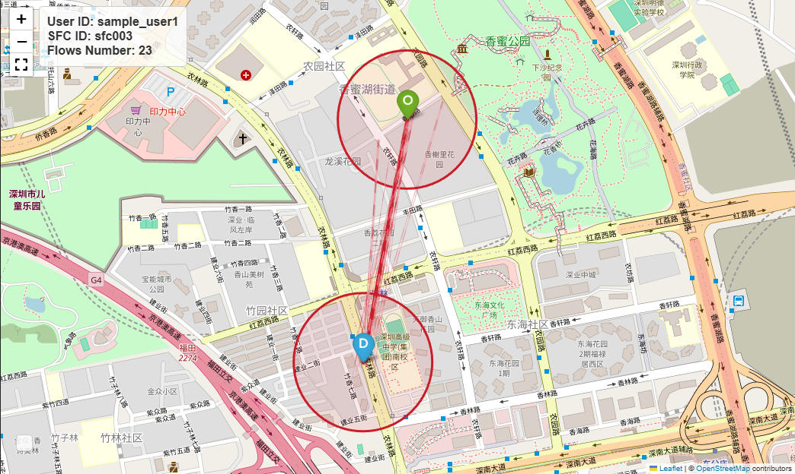
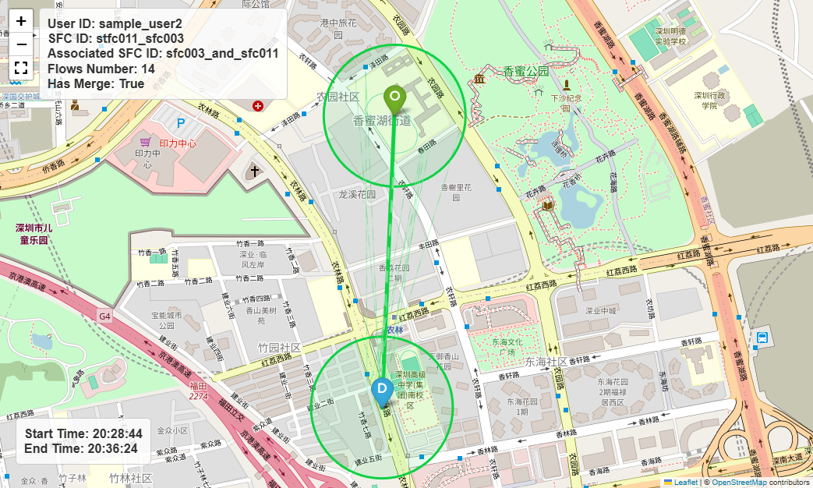
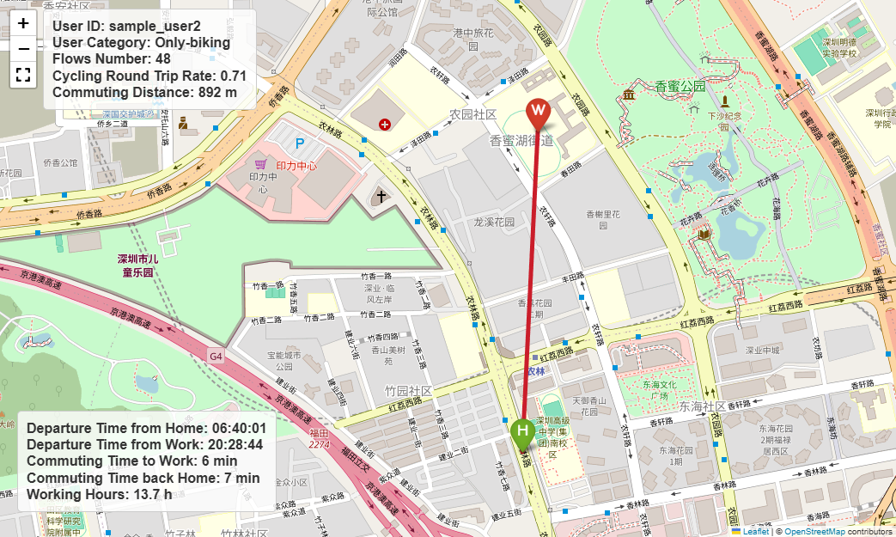

# framework-integrating-STF-clustering-and-DTs

The code for the paper "Mining individual daily commuting patterns of dockless bike-sharing users: a two-layer framework integrating spatiotemporal flow clustering and rule-based decision trees"

### 🌈 Overview

<figure>
<div align="center">

</div>

<div align='center'>

**Figure 1. Schematic diagram of two-layer framework.**

</div>
</figure>
<br>

### 📑 Note

- In Layer 1, we improved the flow clustering methods proposed by [Gao et al.(2020)](https://doi.org/10.1109/ACCESS.2018.2864662) and [Yao et al.(2018)](https://doi.org/10.1109/ACCESS.2020.3040852) based on the features of dockless bike-sharing data and characteristics of bike-sharing usage. The improved spatiotemporal flow clustering method can mine spatiotemporal flow clusters representing individual daily cycling trajectories from bike-sharing data with user IDs (the data volume should not be too small).  It overcomes the limitation that it is difficult to extract individual daily mobility patterns from the complex and chaotic data on dockless bike-sharing. Furthermore, we believe that this method can be further expanded and developed in the following aspects.
  
  1. In addition to dockless bike-sharing data, this method can also be applied to **taxi data or other shared mobility data** with similar data characteristics, but some parameters may need to be adjusted appropriately according to the characteristics of the specific mode of transportation.
  
  2. Our method uses Euclidean distance to determine whether different flows are spatially close. In the future, **network distance** could be considered as a replacement for Euclidean distance to achieve results that are closer to reality.
  
  3. In the original flow clustering method, different flows can be clustered with the inclusion of weight values, but we have not considered weight values at this study. In other words, all flows have the same weight. In some cases, considering **the weight values of flows** may improve the final results of the model.
  
  4. We are currently not particularly focused on the **computational efficiency** of the method, and there is still room for improvement in this aspect.

- In Layer 2, we have taken into account round-trip travel, working hours, and public transport transfers to construct multiple rule-based decision trees. These decision trees are used to identify each user's daily commuting trajectories from his/her individual spatiotemporal flow clusters extracted in Layer 1, as the spatiotemporal flow clusters lack specific activity semantic information. Moreover, based on the daily commuting flows of individual users, we have divided them into four categories of biking commuters: *Only-biking*, *Biking-transit*, *Transit-biking*, and *Biking-transit-biking*, and determined their commuting characteristics (such as residence and workplace locations, commuting distance, and working hours). Furthermore, by conducting proximity analysis between the identified residential locations of these users and the actual residential land boundaries, we have demonstrated the feasibility and effectiveness of the identification results. However, we must acknowledge that the current method still has some limitations that need to be improved in the future:
  
  1. It is necessary to validate our identification results with **traditional travel survey data**. Alternatively, the parameters in the decision trees could be appropriately adjusted based on traditional travel survey data. However, we currently do not have access to travel survey data related to cycling behavior within the study area.
  
  2. Conducting proximity analysis between the users' identified residential locations and the actual residential land boundaries is an alternative solution to demonstrate the feasibility of the method in Layer 2 . Meanwhile, the rule-based decision trees we constructed did not use any land use boundary data to spatially constrain the identification results, so it is inevitable that there will be some deviation in the workplace and residential locations of some users in the final results. Hence, subsequent research could consider optimizing the decision tree method by **taking into account land use functional boundaries**.
  
  3. In addition to using rule-based decision tree methods, future research could also consider coupling the spatiotemporal flow clusters, which lack activity semantics, with other urban function or environmental data (such as **functional land use**, **points of interest**, and even **street view image data**). By employing some machine learning methods, it could infer richer individual daily activity semantics (not only commuting trips), thereby revealing the interaction between cycling populations and the urban environment from an individual level.

<br>

### 🗺️ Visualization results

<figure>
<div align="center">

</div>

<div align='center'>

**Figure 2. A visualisation example of individual spatial flow cluster.**

</div>
</figure>

<figure>
<div align="center">

</div>
<div align='center'>

**Figure 3. A visualisation example of individual spatiotemporal flow cluster.**

</div>
</figure>

<figure>
<div align="center">

</div>

<div align='center'>

**Figure 4. A visualisation example of candidate commuting flow.**

</div>
</figure>

### ⭐ Citation

If you find this code useful in your research, please cite our paper:

```
 Mining individual daily commuting patterns of dockless bike-sharing users: A two-layer framework integrating spatiotemporal flow clustering and rule-based decision trees
```
